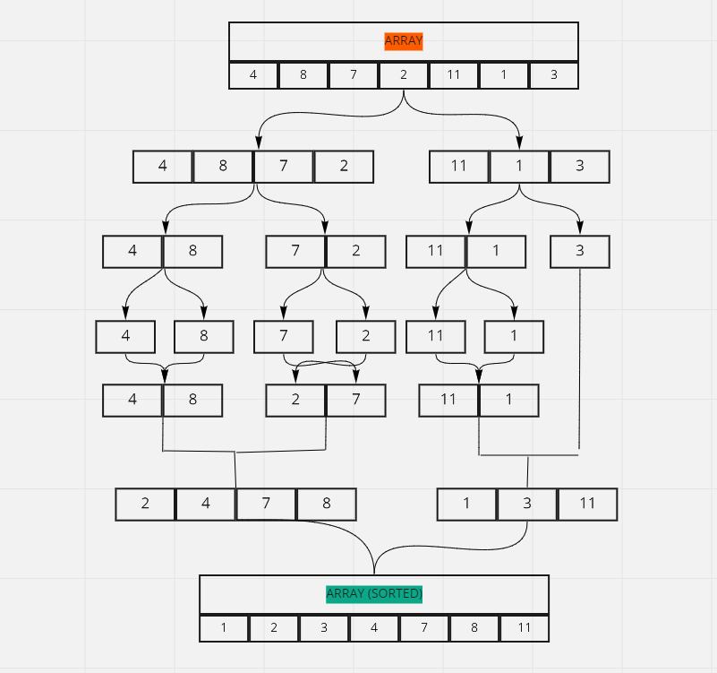

# CODE CHALLENGE 27 | MERGE SORT

### What Is Merge Sort?
Merge sort uses the concept of divide-and-conquer to sort the given list of elements. It breaks down the problem into smaller subproblems until they become simple enough to solve directly.

Here are the steps Merge Sort takes:

- Split the given list into two halves (roughly equal halves in case of a list with an odd number of elements).

- Continue dividing the subarrays in the same manner until you are left with only single element arrays.

- Starting with the single element arrays, merge the subarrays so that each merged subarray is sorted.

- Repeat step 3 unit with end up with a single sorted array.

### VISUAL AND EXPLINATION

With the idea of utilizing how merge sort works, first, we need to break apart the main array of [ 4, 8, 7, 2, 11, 1, 3] into a two smaller arrays.

From that point, we will then sort those two smaller arrays, before utilizing a merge() function to bring them back together into a single array.

This can be done by going over both of these subarrays, and adding one by one element so that the resulting array is also sorted. This can again be done by creating a function called merge, that takes in both the left and right sub-arrays

```
 function merge(left, right) {
    let arr = []
    while (left.length && right.length) {

        if (left[0] < right[0]) {
            arr.push(left.shift())  
        } else {
            arr.push(right.shift()) 
        }
    }
    return [ ...arr, ...left, ...right ]
}
```

By first creating an empty array, the smaller of the smallest unpicked element in the left and right subarrays are picked out and pushed them into the empty array. Only check the first elements in the left and right subarrays since they are both sorted.

While doing this, we delete the picked element from the subarray (this is achieved using the shift() function). We continue this process until one of the subarrays becomes empty. After that, we push the leftover elements of the non-empty subarray (because they are already sorted) into the main array.

Within this merge function, left and right are used as our two sub-arrays. With these , we are able to sort them outright, before merging them back into one, single, merge-sorted array.

Now, it's time to merge the two sub arrays back together. Creating a function called mergedSort, this will allow for that to happen.

```
function mergeSort(array) {
  const half = array.length / 2
  
  if(array.length < 2){
    return array 
  }
  
  const left = array.splice(0, half)
  return merge(mergeSort(left),mergeSort(array))
}

```
In the above code block, we identify the midpoint and split the array into two subarrays using the splice() function. If there are an odd number of elements, the left one gets a smaller number of elements. We are dividing until we are left with single element arrays (array.length < 2). After that, we start combining the subarrays using the previously written merge() function.

At this point, a simple console.log of mergeSort(array); gets the expected output back of the array now merged and sorted correctly [1, 2, 3, 4, 7, 8, 11]



### CONCLUSION

While there are numerous algorithms for sorting arrays, merge sort works well as one of these. With a high focus on showcasing the example of the divide-and-conquer strategy, merge sort shows its usefulness in this regard when it comes to the other sorting algorithms.

